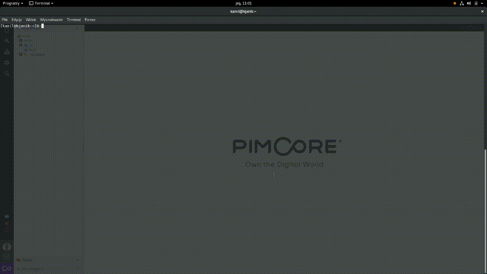

# Pimcore GraphQl
This work is a WIP. Pimcore graphQl exposes endpoint, for fetching data from DataObject's.
(What still need to be done, is better decoupling, naming, adding rest of the "pimcore types", mutations, filtering, multi-class references)  
**Table of Contents**

- [Pimcore GraphQl](#)
	- [Compatibility](#compatibility)
	- [Installing/Getting started](#installinggetting-started)
	- [Developing](#developing)
	- [Deploying/Publishing](#deployingpublishing)
	- [Configuration](#)
	- [Contributing](#)
	- [Licensing](#)
	- [Standards & Code Quality](#)
	- [About Authors](#)

## Compatibility
This module is compatible with Pimcore 5.1.0 and higher. It requires PHP in version 7.0 or higher.

## Installing/Getting started
composer require divanteltd/pimcore-graphql
On Pimcore level - You need to create rest user, and generate API key, which will be used for graphql communication.
Set up default localisation for site, in Pimcore settings.

## Developing
... to be done ..

## Deploying/Publishing
... to be done ..

## Contributing

If you'd like to contribute, please fork the repository and use a feature branch. Pull requests are warmly welcome.

## Licensing
The code in this project is licensed under the GPLv3 license.

## Standards & Code Quality
This module respects all Pimcore5 code quality rules and our own PHPCS and PHPMD rulesets.

## About Authors

Founded in 2008, Divante is an expert in providing top-notch eCommerce solutions and products for both B2B and B2C segments. By supporting our clients in sales growth, we define completely novel ideas, implement the latest technologies, and deliver an unprecedented user experience.

We work with industry leaders, like T-Mobile, Continental, and 3M, who perceive technology as their key component to success. 

Our team of 170+ in-house experts from various fields includes 30+ certified Magento developers, 30+ Pimcore developers, JS developers (Vue, Angular, React), product designers, analysts, project managers & testers.

As a digital pioneer and strategic partner, our core competencies are focused on the enterprise open source software ecosystem and customized software solutions (we love Pimcore, Magento, Symfony3, Node.js, Angular, React, Vue.js and many others). We offer innovative solutions for eCommerce system and support ERP, PIM, and CRM solutions- to list just a few.

In Divante we trust in cooperation, that's why we contribute to open source products and create our own products like [Open Loyalty](http://www.openloyalty.io/ "Open Loyalty") and [Vue.js Storefront](https://github.com/DivanteLtd/vue-storefront "Vue.js Storefront").

OUR SERVICES

* **VueJs, Angular, React**
* **Microservices for eCommerce**
* **Magento Development**
* **Pimcore Development**
* **OroCommerce Development**
* **Frontend development for: PrestaShop, Shopware, SAP hybris, Shopify**
* **Integrations**

We are part of the OEX Group which is listed on the Warsaw Stock Exchange. Our annual revenue has been growing at a minimum of about 30% year on year.

Visit our website [Divante.co](https://divante.co/ "Divante.co") for more information.
