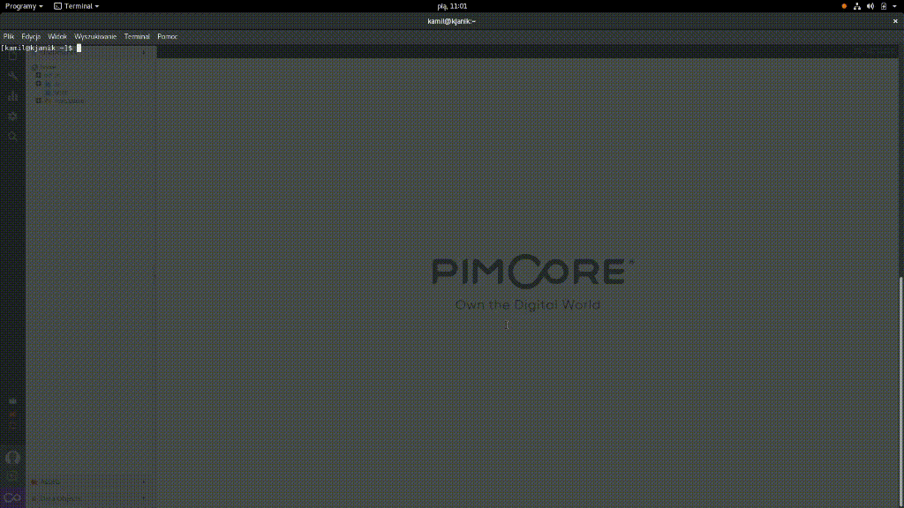

# Pimcore GraphQl
This work is a WIP. Pimcore graphQl exposes endpoint, for fetching data from DataObject's.
(What still need to be done, is better decoupling, naming, adding rest of the "pimcore types", mutations, filtering, multi-class references)  
**Table of Contents**

- [Pimcore GraphQl](#)
	- [Compatibility](#compatibility)
	- [Installing/Getting started](#installinggetting-started)
	- [Developing](#developing)
	- [Deploying/Publishing](#deployingpublishing)
	- [Configuration](#)
	- [Contributing](#)
	- [Licensing](#)
	- [Standards & Code Quality](#)
	- [About Authors](#)

## Compatibility
This module is compatible with Pimcore 5.1.0 and higher. It requires PHP in version 7.0 or higher.

## Installing/Getting started
composer require divanteltd/pimcore-graphql
On Pimcore level - You need to create rest user, and generate API key, which will be used for graphql communication.
Set up default localisation for site, in Pimcore settings.

## Developing
... to be done ..

## Deploying/Publishing
... to be done ..

## Contributing

If you'd like to contribute, please fork the repository and use a feature branch. Pull requests are warmly welcome.

## Licensing
The code in this project is licensed under the GPLv3 license.

## Standards & Code Quality
This module respects all Pimcore5 code quality rules and our own PHPCS and PHPMD rulesets.

## About Authors

We are a Software House from Europe, existing from 2008 and employing about 150 people. Our core competencies are built around Magento, Pimcore and bespoke software projects (we love Symfony3, Node.js, Angular, React, Vue.js). We specialize in sophisticated integration projects trying to connect hardcore IT with good product design and UX.

We work for Clients like INTERSPORT, ING, Odlo, Onderdelenwinkel and CDP, the company that produced The Witcher game. We develop two projects: [Open Loyalty](http://www.openloyalty.io/ "Open Loyalty") - an open source loyalty program and [Vue.js Storefront](https://github.com/DivanteLtd/vue-storefront "Vue.js Storefront").

We are part of the OEX Group which is listed on the Warsaw Stock Exchange. Our annual revenue has been growing at a minimum of about 30% year on year.

Visit our website [Divante.co](https://divante.co/ "Divante.co") for more information.
