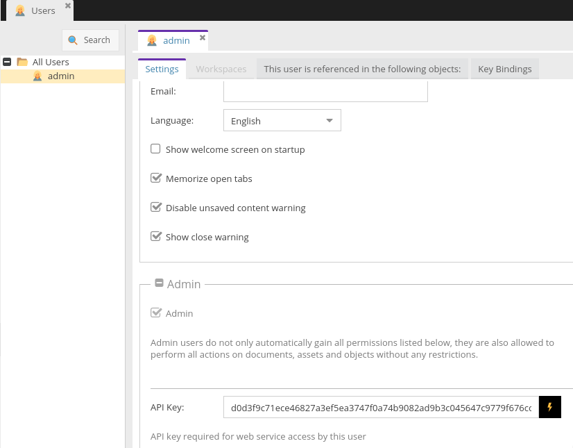
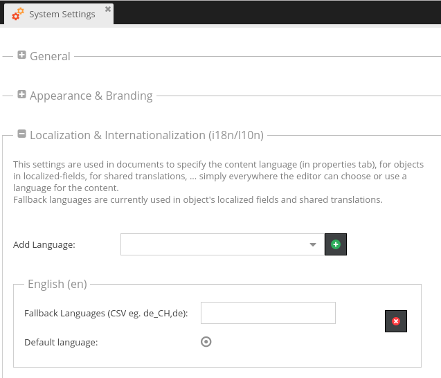
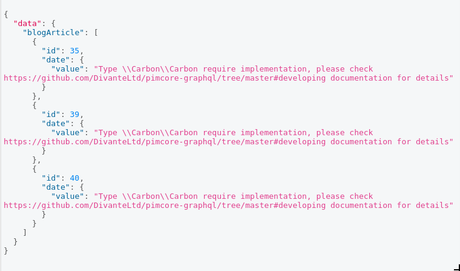

# Pimcore GraphQl
Pimcore graphQl is a whole solution for building Your API.
You can model Your data with simple, point and click/ drag and drop, interface, fill the data with Pimcore based backend, and our application will generate the whole graphQl schema for You. 
  
**Table of Contents**

- [Pimcore GraphQl](#)
	- [Compatibility](#compatibility)
	- [Installing/Getting started](#installinggetting-started)
	- [Developing](#developing)
	- [Configuration](#)
	- [Contributing](#)
	- [Licensing](#)
	- [Standards & Code Quality](#)
	- [About Authors](#)

## Compatibility
This module is compatible with Pimcore 5.1.0 and higher. It requires PHP in version 7.0 or higher.


## Installing/Getting started
For existing Pimcore instalations just run `composer require divanteltd/pimcore-graphql`
If You dont have Pimore instance, pleas use one of many docker images like [this](https://github.com/dpfaffenbauer/pimcore-docker-compose), follow the instructions, after successfull instalation ssh to container and run command form above.

On Pimcore level - You need to create rest user, and generate API key, which will be used for graphql communication.



Set up default localisation for site, in System settings.



For testing You can use tool like ChromeiQL, setup endpoint address `http://[your-host:your-port]/webservice/graphql/graph?apikey=[your-apikey]` and You are ready to go.


Now You are ready to model Your data

###Create the Class Model/Definition

Go to: Settings -> Object -> Classes and click the button Add Class.


Now, there is a new product class/model which is a representation of your entity including the underlying database scheme as well as a generated PHP class you can use to create, update, list and delete your entities.

The product should have the following attributes: SKU, picture, name and description. Follow these steps to add them:

* Go to the edit page of the class product
* Click right on Base and select Add Layout Component -> Panel - This is the main panel/container for the following product attributes
* To add attributes: 
  * Click right on Panel, then Add data component -> Text -> Input, then change the name of the input component to sku (in the edit panel on the right side)
  * Just the same way you add the new data field for name
  * Now we're going to add a WYSIWYG attribute for the description. Again, click right, select Add data component -> Text -> WYSIWYG. We name it description.
  * The last attribute is for the picture. We can use on of the specialized image components in Other -> Image. Name the attribute picture.
If everything goes well, the new class looks like in the picture:


Important: Every generated class in the Pimcore admin panel has also an accordingly PHP class with getters and setters. You can find the PHP class representation of our newly created class definition above in var/classes/DataObject/Product.php

###Add a new Object
We've just prepared a simple class for new products. Now we can use it to create objects in Pimcore.

* Open the objects section on the left and click on the right button after Home (Note that you can create also directories structure for objects).
* Choose Add object -> product and fill the input with a name, for example: tshirt
* Add values for sku, name and description attributes.
* Click Save & Publish

Probably, your view looks like below:


The last step to finish the product object is add a photo.

The one way to upload a photo is this button: 


Upload image to an object or just drag file which you uploaded from Assets section.

Click Save & Publish button.

That's it.


For more detailed information please refer [here](https://pimcore.com/docs/5.x/Development_Documentation/Objects/index.html)

Quick summary


## Developing

In some cases You will see this kind of output from Your graphQl query



Looks like You are using custom type, in Your class.
What You need to do, is to implement following interface
```php
<?php

namespace Divante\GraphQlBundle\TypeFactory;

use GraphQL\Type\Definition\ObjectType;

interface ICustomTypeFactory
{
    public function supports(string $type) : bool;
    public function getCustomType() : ObjectType;
}
```

and add Your implementation to Your service config, with tag `tags: ['graphql.custom.type']`
```yml
    Your\Class:
        tags: ['graphql.custom.type']
```
As reference use class `Divante\GraphQlBundle\TypeFactory\Classificationstore`, and configuration `src/Resources/config/services.yml` 

## Contributing

If you'd like to contribute, please fork the repository and use a feature branch. Pull requests are warmly welcome.

## Licensing
The code in this project is licensed under the GPLv3 license.

## Standards & Code Quality
This module respects all Pimcore5 code quality rules and our own PHPCS and PHPMD rulesets.

## <a name="authors"></a>About Authors


Founded in 2008, Divante is an expert in providing top-notch eCommerce solutions and products for both B2B and B2C segments. By supporting our clients in sales growth, we define completely novel ideas, implement the latest technologies, and deliver an unprecedented user experience.

We work with industry leaders, like T-Mobile, Continental, and 3M, who perceive technology as their key component to success. 

Our team of 170+ in-house experts from various fields includes 30+ certified Magento developers, 30+ Pimcore developers, JS developers (Vue, Angular, React), product designers, analysts, project managers & testers.

As a digital pioneer and strategic partner, our core competencies are focused on the enterprise open source software ecosystem and customized software solutions (we love Pimcore, Magento, Symfony3, Node.js, Angular, React, Vue.js and many others). We offer innovative solutions for eCommerce system and support ERP, PIM, and CRM solutions- to list just a few.

In Divante we trust in cooperation, that's why we contribute to open source products and create our own products like [Open Loyalty](http://www.openloyalty.io/ "Open Loyalty") and [Vue.js Storefront](https://github.com/DivanteLtd/vue-storefront "Vue.js Storefront").

OUR SERVICES

* **VueJs, Angular, React**
* **Microservices for eCommerce**
* **Magento Development**
* **Pimcore Development**
* **OroCommerce Development**
* **Frontend development for: PrestaShop, Shopware, SAP hybris, Shopify**
* **Integrations**

We are part of the OEX Group which is listed on the Warsaw Stock Exchange. Our annual revenue has been growing at a minimum of about 30% year on year.

Visit our website [Divante.co](https://divante.co/ "Divante.co") for more information.
